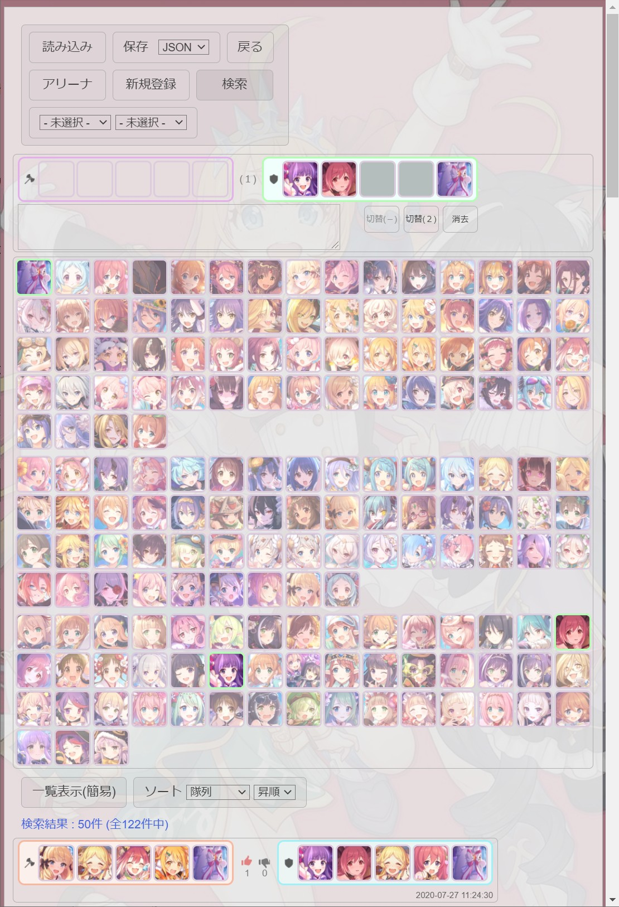

# 【プリコネR】プリコネノート【編成ツール】

プリンセスコネクト！Re:Dive(プリコネR)用のアリーナやクランバトルの編成、検索が行えるツールです。

## スクリーンショット

## 使い方(ローカルモード)

HTMLファイルをブラウザで開くだけで使えます。

作成したデータはファイルのダウンロードで保存し、次回以降はファイルのアップロードで読み込みます。

## 使い方(サーバーモード)

Node.jsでサーバープログラムを起動し、ブラウザでアクセスすることで利用可能です。

作成したデータはサーバー側にファイルとして自動的に保存されます。

## 詳しい使い方

index.htmlを参照してください。
